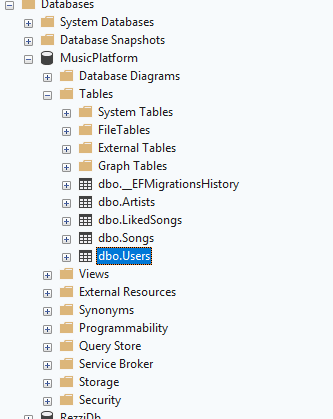
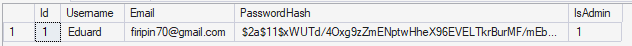

# CourseWork
MusicPlatform

Інструкції по запуску проєкту. 

Також додана папка templates в якій вже є декілька пісень без авторських прав, лого артистів та обложки для пісень, можете використовувати їх для тестування або можете завантажувати свої.

1. Встановлення ПЗ.
    - встановити .net 10 з оффіційного сайту microsoft, "dotnet --version" в терміналі для перевірки. 
    - встановити node.js + angular cli, "node -v" та "ng v" в терміналі для перевірки.  
    - встановити sql server express  

    1.1. Посилання для встановлення ПЗ.
        .net10 "https://dotnet.microsoft.com/en-us/download/dotnet/10.0".
        node.js "https://nodejs.org/en/download", 
        angular cli "npm install -g @angular/cli" в терміналі. (після встановлення node.js)
        sql server "https://www.microsoft.com/en-us/sql-server/sql-server-downloads"

2. Налаштування бд. 
    - створити БД, замінити ConnectionString в appsettings.Development.json на свій ConnectionString 

3. Запуск бекенду
    - проєкт треба запускати з CourseWork.API "cd CourseWork.API"
    - dotnet ef database update, перед першим запуском, це також треба робити з CourseWork.API 
    - dotnet run для запуску, також з CourseWork.API.

4. Запуск фронтенду
    - проєкт треба запускати з CourseWork.UI "cd CourseWork.UI"
    - "npm install" перед першим запускож, це також треба робити з CourseWork.UI
    - "ng serve" для запуску проєкту, також CourseWork.UI

5. Авторизація. 
    В проєкті є адмін панель для додавання артистів та пісень, для того щоб вона з'явилась треба внести зміни в БД

    Приклад в SSMS 22
    - зареєструватись в системі. 
    - знайдіть таблицю з юзерами 
    - 
    - поле isAdmin(по стандарту 0) замініть на 1
    -   

 -------------------------------
Для запуску на macOs/linux

Всі кроки ті самі, окрім SQL Server — на macOS/Linux він встановлюється через Docker.

1. Встановити Docker Desktop "https://www.docker.com/products/docker-desktop"

2. Запустити SQL Server контейнер (замінити YOUR_PASSWORD та YOUR_DB_NAME на свій пароль та назву дб" в проєкті використовується назва MusicPlatform" ):
    
    docker run -e "ACCEPT_EULA=Y" -e "SA_PASSWORD=YOUR_PASSWORD" -p 1433:1433 -d mcr.microsoft.com/mssql/server:2022-latest

3. Замінити ConnectionString в appsettings.Development.json на:
    "Server=localhost,1433;Database=YOUR_DB_NAME;User Id=SA;Password=YOUR_PASSWORD;TrustServerCertificate=True;"

4. Далі — кроки 3 і 4 з основної інструкції (dotnet ef database update, dotnet run, ng serve).
 